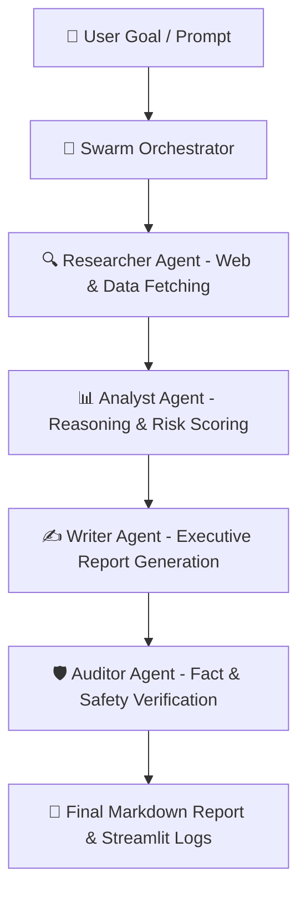

# AgentCraft AI 🤖

<div align="center">
  <h3>Autonomous Multi-Agent Swarm Orchestration Platform</h3>
  <p><em>Plateforme d'Orchestration de Multi-Agents IA Autonomes</em></p>

  <br />
  
  <!-- Demonstration Banner -->
  <div style="border: 1px solid rgba(255,255,255,0.2); border-radius: 12px; padding: 10px; background: rgba(0,0,0,0.5);">
    
    <p><sub>🎬 <b>Demonstration / Aperçu Visuel :</b> Remplacez <code>preview.gif</code> par la vraie démo animée du projet.</sub></p>
  </div>

  <br />
     
</div>

---

<details open>
  <summary><b>📌 Table of Contents / Table des matières</b></summary>
  <ul>
    <li><a href="#-english">🇬🇧 English</a></li>
    <ul>
      <li><a href="#-about-the-project">About the Project</a></li>
      <li><a href="#-architecture--data-flow">Architecture & Data Flow</a></li>
      <li><a href="#-key-features">Key Features</a></li>
      <li><a href="#-getting-started">Getting Started</a></li>
    </ul>
    <li><a href="#-français">🇫🇷 Français</a></li>
    <ul>
      <li><a href="#-à-propos-du-projet">À propos du projet</a></li>
      <li><a href="#-architecture--flux-de-données">Architecture & Flux de données</a></li>
      <li><a href="#-fonctionnalités-clés">Fonctionnalités clés</a></li>
      <li><a href="#-démarrage-rapide">Démarrage rapide</a></li>
    </ul>
    <li><a href="#-license--licence">📜 License / Licence</a></li>
  </ul>
</details>

---

## 🇬🇧 English

### 📖 About the Project
AgentCraft AI is an autonomous Multi-Agent Swarm platform where specialized AI agents (Researcher, Analyst, Writer, Auditor) collaborate asynchronously to turn complex user prompts into comprehensive, verified executive intelligence reports.

### 🏗️ Architecture & Data Flow


### ✨ Key Features
- 🤖 **Multi-Agent Swarm**: Autonomous collaboration between specialized agents (Dr. Vance, Elena Rostova, Marcus Chen)
- 💬 **Live Reasoning Logs**: Real-time streaming of inter-agent thoughts, tool calls, and debate
- 🎯 **Role-Based Task Delegation**: Intelligent task decomposition and risk auditing
- 📑 **Executive Reports**: Automatic generation of formatted Markdown reports with citations
- 🛡️ **Enterprise Security**: Input sanitization, rate-limiting, and safe export filters

### 💻 Getting Started
To install and run this project locally:
```bash
python -m venv venv
venv\Scripts\activate
pip install -r requirements.txt
streamlit run app.py
```

---

## 🇫🇷 Français

### 📖 À propos du projet
AgentCraft AI est une plateforme de Multi-Agents IA autonomes où des agents spécialisés (Chercheur, Analyste, Rédacteur, Auditeur) collaborent de manière asynchrone pour transformer vos objectifs en rapports exécutifs d'intelligence complets.

### 🏗️ Architecture & Flux de données


### ✨ Fonctionnalités clés
- 🤖 **Swarm Multi-Agents**: Collaboration autonome entre agents spécialisés (Chercheur, Analyste, Rédacteur)
- 💬 **Journal de Réflexion en Direct**: Streaming des pensées inter-agents et appels d'outils
- 🎯 **Délégation par Rôles**: Décomposition intelligente de tâches complexes et évaluation des risques
- 📑 **Rapports Exécutifs**: Génération automatique de synthèses structurées au format Markdown
- 🛡️ **Sécurité Entreprise**: Assainissement des requêtes, gestion des quotas et export sécurisé

### 💻 Démarrage rapide
Pour installer et lancer ce projet localement :
```bash
python -m venv venv
venv\Scripts\activate
pip install -r requirements.txt
streamlit run app.py
```

---

## 📜 License / Licence
Distributed under the MIT License. Copyright © 2026 **Ricardo Ratovoarisoa**. All rights reserved.

---
<div align="center">
  <sub>Built with ❤️ by <b>Ricardo Ratovoarisoa</b> | AI & Full-Stack Developer</sub>
</div>
